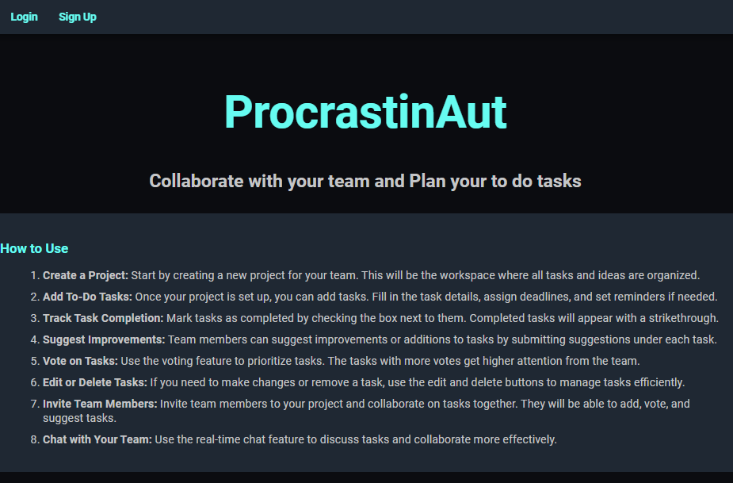

# ProcrastinAut

ProcrastinAut is a project management and team collaboration application that allows users to create, manage, and complete tasks while tracking their team's progress. The app is designed to help teams stay organized, track their work, and plan their tasks collaboratively.

## Features

- **User Authentication**: Sign up, log in, log out, and manage user profiles.
- **Project Management**: Create, update, and delete projects. View project details and manage associated tasks.
- **Task Management**: Create, update, and delete tasks with optional due dates and reminders. Users can mark tasks as completed, vote on tasks, and make suggestions.
- **Team Collaboration**: Invite team members to collaborate on projects.
- **Task Completion Tracking**: Track which tasks are completed and which are still in progress.
- **Real-time Chat**: Chat feature for team discussions, integrated with WebSocket for real-time communication.
- **Responsive Design**: The app is mobile-friendly and works well on different screen sizes.

## Technologies Used

- **Backend**: Django 5.1.1
- **Frontend**: HTML, CSS, JavaScript
- **Database**: SQLite (default for development), easily configurable to use PostgreSQL or MySQL
- **WebSocket**: Daphne for real-time communication in the chat system
- **WSGI**: Gunicorn for production-ready app hosting
- **CSS Framework**: Custom styles using CSS and Google Fonts

## Future Enhancements 
- Mail System 
- Enhanced Chat System 